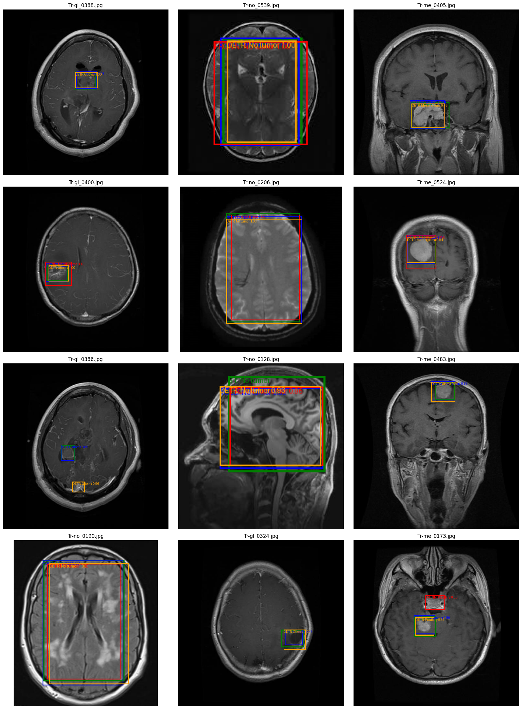
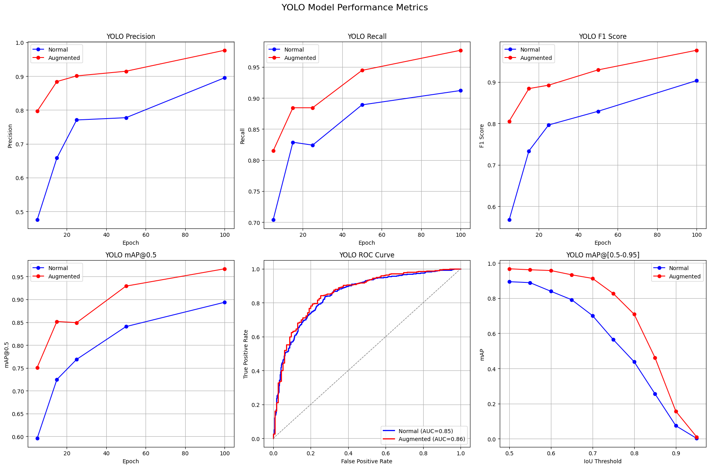
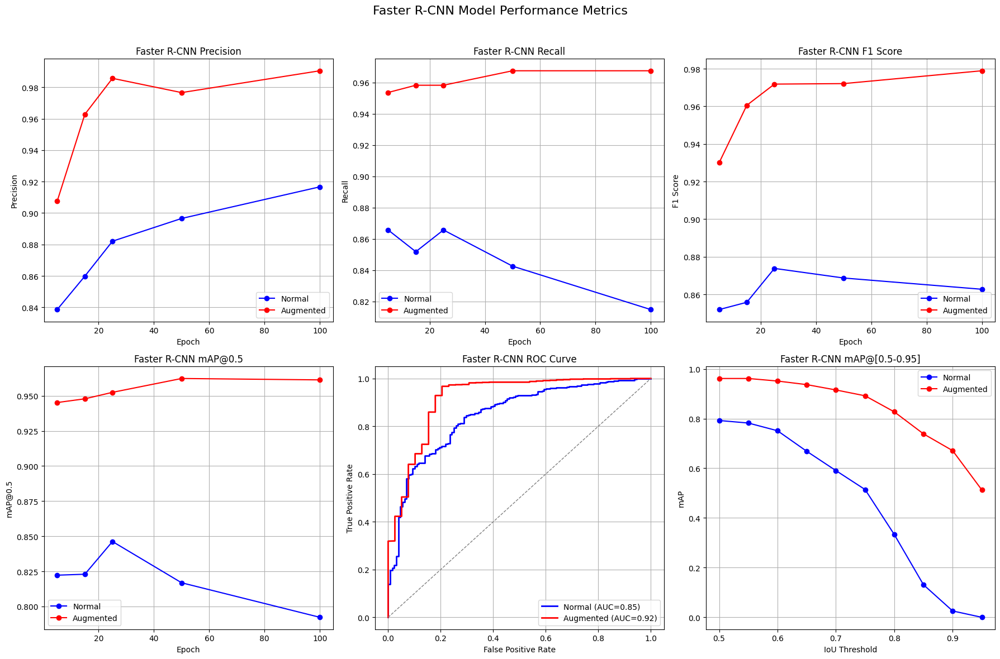
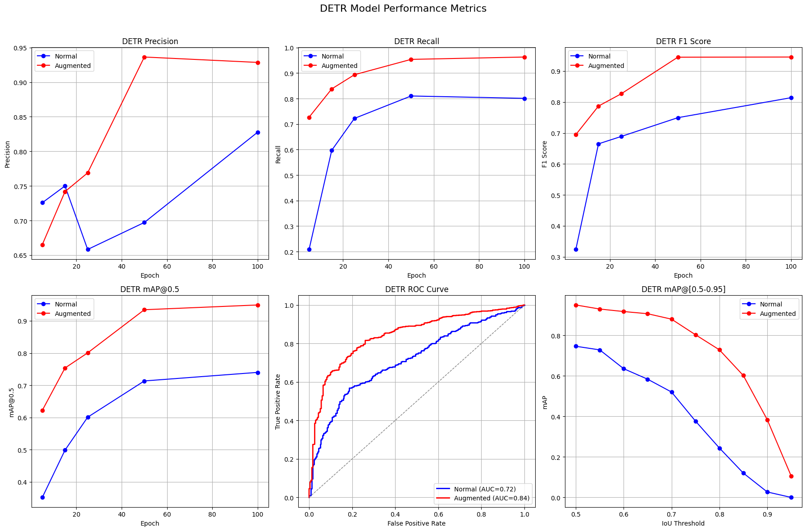
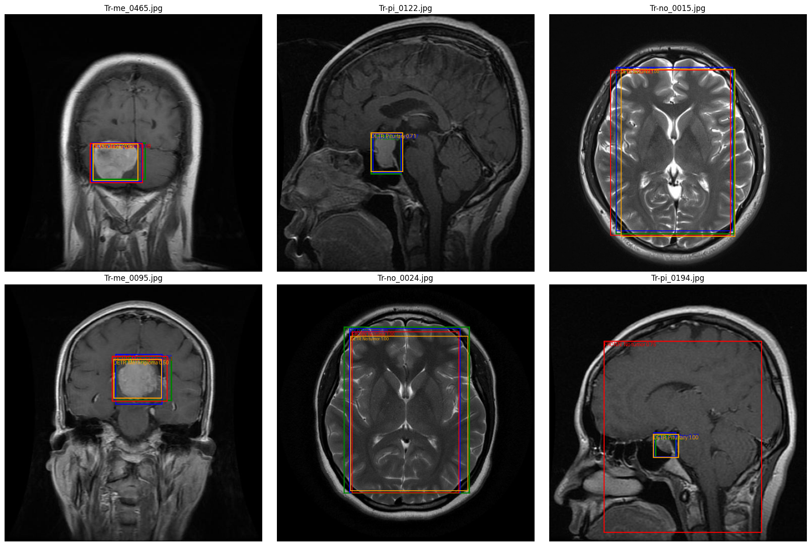
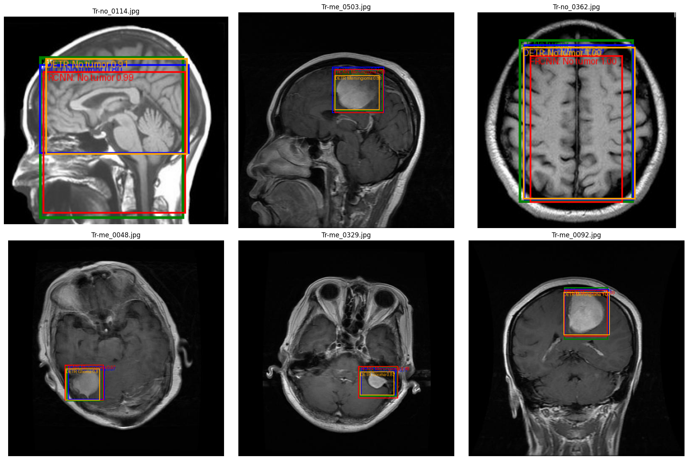
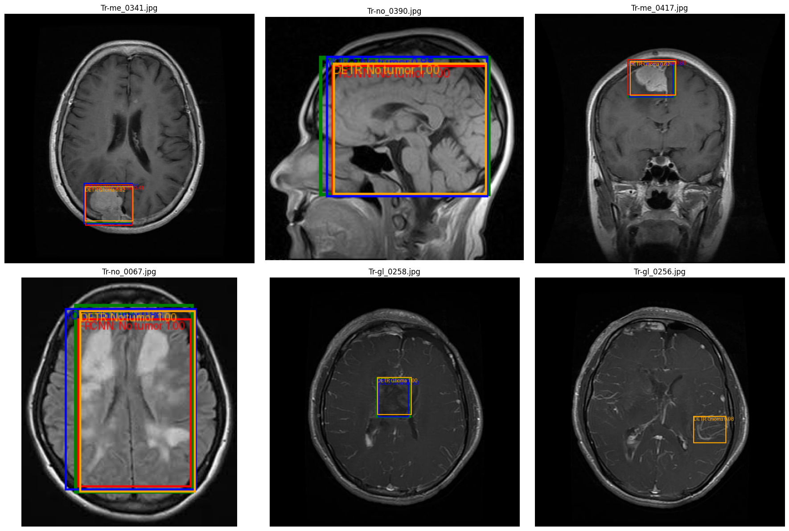

# Brain Tumor Detection with Deep Learning

This repository contains the implementation and evaluation of advanced deep learning models (YOLOv11, Faster R-CNN v2, and DETR) applied to brain tumor detection using MRI images. The project systematically explores the balance between diagnostic accuracy, implementation complexity, and practical deployment, aiming to identify the most effective approach for clinical and exploratory use cases.



## Project Overview

Brain tumors significantly impact human health, emphasizing the critical importance of early detection and accurate diagnosis. This project addresses the challenge by applying cutting-edge object detection models to publicly available MRI datasets. Comprehensive evaluations were conducted to analyze each model's performance, practicality, and adaptability for clinical use.

## Models Evaluated

- **YOLOv11**: One-stage object detection algorithm, notable for ease of implementation and rapid prototyping.
- **Faster R-CNN v2**: Two-stage detection model providing high localization accuracy but requiring more extensive computational resources and implementation complexity.
- **DETR (DEtection TRansformer)**: Transformer-based approach focusing on modeling long-range dependencies, evaluated for its unique strengths and limitations in medical imaging.

## Dataset

The models were trained and evaluated on an MRI-based brain tumor dataset consisting of approximately 1,600 original, and later augmented to around 6000 images (can be augmented up to 16,000), annotated with bounding boxes for tumors.

The original dataset is available here [Kaggle](https://www.kaggle.com/datasets/ammarahmed310/labeled-mri-brain-tumor-dataset).

## Key Results

| Model | Precision | Recall | F1-score | mAP@0.5 | AUC |
|-------|-----------|--------|----------|---------|-----|
| YOLOv11 | 0.977 | 0.977 | 0.977 | 0.967 | 0.86 |
| Faster R-CNN | 0.977 | 0.968 | 0.972 | 0.962 | 0.92 |
| DETR | 0.929 | 0.963 | 0.946 | 0.949 | 0.84 |

Faster R-CNN demonstrated the best performance, particularly in precise tumor localization, while YOLOv11 showed strong practicality and ease of deployment.

## Results and Examples

### YOLOv11



### Faster R-CNN



### DETR



### Some Examples





## Setup and Installation

Create a new Python environment (optional but recommended):

```bash
python -m venv btd
source btd/bin/activate
```

Install dependencies:
```bash
pip install -r requirements.txt
```

## Usage

Detailed instructions on dataset formatting, model training, evaluation, and deployment are included within individual model directories (`/YOLOv11`, `/Faster-RCNN`, `/DETR`).

## Project Structure

```
.
├── datasets/          # Dataset for images and annotations
├── models/            # Model weights
│   ├── YOLOv11/
│   ├── FRCNN/
│   └── DETR/
├── *.ipynb/           # All notebooks for data analysis, processing, model training and evaluation
└── README.md
```

## Future Work

The project highlights numerous avenues for enhancement, including:
- Expanding data augmentation techniques (intensity-based and GAN-generated images).
- Transitioning from bounding-box detection to pixel-level segmentation.
- Applying models to diverse anatomical regions and multimodal imaging data (MRI, CT, PET).
- Development of universal medical imaging frameworks inspired by medSAM.